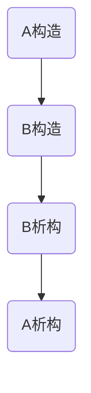

# 构造函数

# 析构函数

# 对象创建到销毁构造析构调用顺序

A：基类；

B：派生类；

从创建到销毁构造析构调用顺序。

# 常见问题

## 1.构造函数不可以是虚函数

虚函数的调用依赖于虚函数表，而指向虚函数表的指针`vptr`需要在构造函数中进行初始化，所以无法调用定义为虚函数的构造函数。

## 2.构造/析构函数不占据内存空间

对象的大小是指在类实例化出的对象当中，他的数据成员所占据的内存大小，而不包括成员函数，所以不占用。

## 3.基类的析构函数需要定义为虚函数

> 为了实现动态绑定，基类指针指向派生类对象，如果析构函数不是虚函数，那么在对象销毁时，就会调用基类的析构函数，只能销毁派生类对象中的部分数据，所以必须将析构函数定义为虚函数，从而在对象销毁时，调用派生类的析构函数，从而销毁派生类对象中的所有数据。

主要是：

1. 多态上转型接收时 如果不是虚析构，对象销毁时会调用基类的析构函数。
2. 同时，虚析构时，才会调用到派生类的析构。

