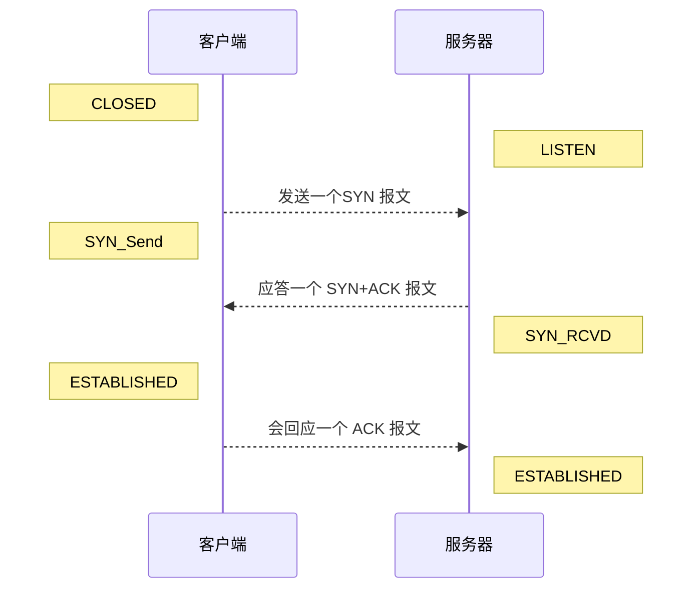

[TOC]

# TCP的三次握手

TCP开始传输时 需要建立连接，建立连接过程中会进行三次数据传输。

## 目的

1.测试传输双方:

- 发送数据能力
- 接受数据能力

2.指定自己的初始化序列号，为后面的可靠传送做准备。

## 过程

刚开始客户端处于 CLOSED 的状态，服务端处于LISTEN状态

1. 第一次握手：客户端发送一个SYN 报文，并指明客户端的初始化序列号 **ISN(c)** 此时客户端处于 **SYN_Send** 状态，服务端收到了。就能得出结论：

   	>客户端的发送能力、服务端的接收能力是正常的。

   

2. 第二次握手：服务端收到SYN 报文之后，自己的 SYN 报文作为应答，并且也是指定了自己的初始化序列号 ISN(s)，同时会把客户端的 ISN + 1 作为 ACK 的值，表示自己已经收到了客户端的 SYN，此时服务器处于 **SYN_RCVD** 的状态。客户端收到了。就能得出结论：

   > 服务端的接收、发送能力，客户端的接收、发送能力是正常的。不过此时服务器并不能确认客户端的接收能力是否正常。

3. 第三次握手：客户端收到 SYN 报文之后，会发送一个 ACK 报文，当然，也是一样把服务器的 ISN + 1 作为 ACK 的值，表示已经收到了服务端的 SYN 报文，此时客户端处于 **ESTABLISHED** 状态。就能得出结论：

   > 客户端的接收、发送能力正常，服务器自己的发送、接收能力也正常。

服务器收到 ACK 报文之后，也处于 **ESTABLISHED 状态**，此时，双方以建立起了链接

## 时序图

