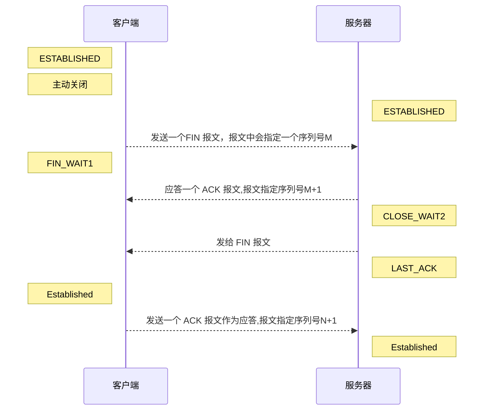

[TOC]

# TCP四次挥手

TCP结束传输时 需要断开连接，断开连接过程中会进行四次数据传输。

## 目的

断开双方的连接。

前两次挥手用于断开一个向的连接，后两次挥手用于断开另一方向的连接。

## 过程

刚开始双方都处于 Establised 状态，假如是客户端先发起关闭请求，

1. 第一次挥手：客户端发送一个 FIN 报文，报文中会指定一个序列号。此时客户端处于**FIN_WAIT1**状态。
2. 第二次握手：服务端收到 FIN 之后，会发送 ACK 报文，且把客户端的序列号值 + 1 作为 ACK 报文的序列号值，表明已经收到客户端的报文了，此时服务端处于 **CLOSE_WAIT2**状态。
3. 第三次挥手：如果服务端也想断开连接了，和客户端的第一次挥手一样，发给 FIN 报文，且指定一个序列号。此时服务端处于 **LAST_ACK** 的状态。
4. 第四次挥手：客户端收到 FIN 之后，一样发送一个 ACK 报文作为应答，且把服务端的序列号值 + 1 作为自己 ACK 报文的序列号值，此时客户端处于 **TIME_WAIT** 状态。需要过一阵子以确保服务端收到自己的 ACK 报文之后才会进入 CLOSED 状态

服务端收到 ACK 报文之后，就处于关闭连接了，处于 CLOSED 状态。

### 时序图

