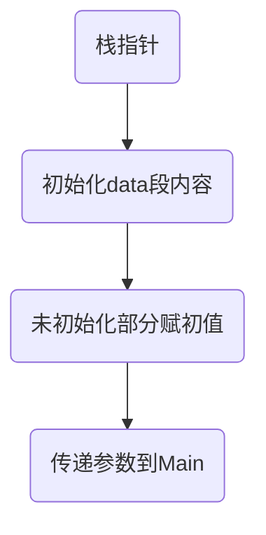

#  main函数

## main函数执行之前进行的操作

1. 设置栈指针；
2. 初始化static静态和global全局变量，即data段的内容；
3. 将未初始化部分的赋初值：数值型short，int，long等为0，bool为FALSE，指针为NULL；
4. 将main函数的参数，argc，argv等传递给main函数，然后才真正运行main函数。

```mermaid
graph TB
A(栈指针)-->B(初始化data段内容);
B-->C(未初始化部分赋初值);
C-->D(传递参数到Main);


```

